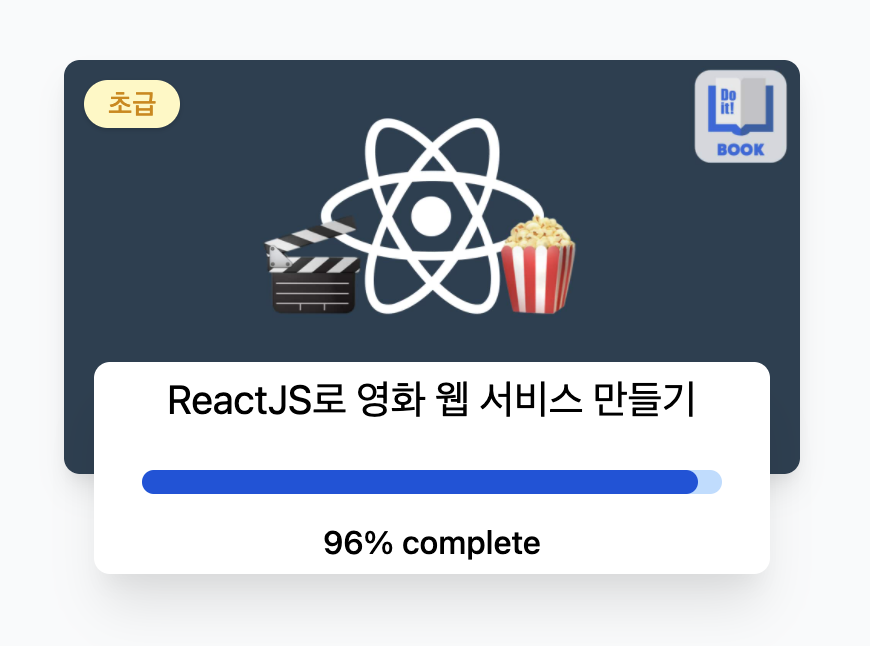

# Movie App 2021

Nomadcoders React Fundamentals Course  

---

## SETUP

- Creating App  
  `npx create-react-app movie-app`
  브라우저가 react의 코드를 읽을 수 있도록 하는 기본적인 것들이 다 탑재되어 있다.  
  react는 쓴 코드를 JavaScript와 함께 HTML에 넣어준다.  
  react는 **재사용**이 가능한 component를 만든다. 그리고 각 component마다 정보를 전달하기 위해 'props'를 이용한다.

---

## w/ The 3rd Libraries

- axios  
  `npm install axios`  
  API로부터 데이터를 받아와서 제어할 수 있는 역할을 한다. fetch 자체를 쓰는 것보다 깔끔하게 이용할 수 있다.

- prop-types  
  `npm i prop-types`  
  전달한 props이 원하는 형식(type)인지 확인해준다. 실수를 덜어준다.

---

## STATE

- state  
  state가 필요한 경우 function보단 class component를 사용한다.  
  this.state 자체로 수정하지 않으며, state의 값을 변경하려고 할 시에는 **반드시** setState()를 이용한다.  
  setState()를 쓰면 react가 render를 호출해야 하는 시점을 알 수 있다. 이를 사용하지 않으면, 새로운 state와 함께 render를 호출하지 않는다.

---

## LIFE CYCLE METHOD

- componentDidMount()
  데이터가 로딩될 때 쓰인다.

- componentDidUpdate()
  setState를 호출시마다 실행되기 때문에 더 많은 데이터를 로딩하거나 state와 props를 변경할 때 쓰인다.

- componentWillUnmount()
  component 자체를 깨끗하게 비울 때 쓰인다.
